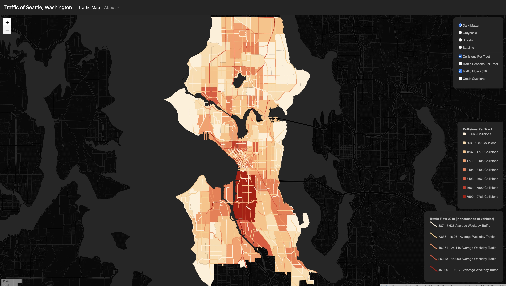

# Traffic of Seattle
## Leo Kwo

Follow [this link](https://leokwo.github.io/Traffic-of-Seattle/) to visit the hosted project website.

### Project description
This project maps the traffic of Seattle. There are multiple elements to traffic. This project shows the **traffic flow**, **crash cushions**, **traffic beacons**, and **collisions** of the City of Seattle. With this project, people who are interested in the traffic/transportation situation of Seattle can easily view and investigate the overall trend of traffic in Seattle. This project also provides quick access links to data sources that it uses, allowing researchers to download and analyze if they so choose.

### Project goal
There are several key takeaways I wish my audience to have with this project:
1. There is a cluster of collisions towards the **South of Downtown Seattle**. The exact cause of this trend is not clear. But I wish people looking at this project can notice this trend and investigate more if possible.
2. The **Southern part of Downtown Seattle** also sees a cluster of Crash Cushions. It is highly possible that these cushions are placed in the area purposefully to reduce collision damage. However, we need to know that preventing collision incidents from taking place is many times better than reducing collision damage. If we want to resolve the collision issues in the area, we need more research and study to understand the exact cause of the high collision rate in the area.
3. Traffic Beacons' distribution does **not** appear to correlate well with any other variable. However, we can all agree traffic beacons can help to improve transportation safety in almost all situations. If we want to reduce collision in any area, we should place more traffic beacons in that area. This observation may help decision-makers to better plan where to put traffic beacons in the future.
4. Looking at the traffic flows of Seattle, it is easy to see that traffic flows in the North-South directions are a lot more common than traffic flows in the East-West directions. In our day-to-day life experiences, we also see that Seattle sees a lot of traffic jams in rush hours in its busy major highways and avenues running from North to South or South to North. This traffic flows map should help decision-makers on future infrastructure upgrading plans, which should prioritize major highways/avenues running in the North-South directions.
5. And many more...

### Data sources
<h4><i>
  Collisions Per Tract
</h4></i>
<a href="https://data-seattlecitygis.opendata.arcgis.com/datasets/collisions">View its data source</a>

  This data source was used to map the number of collisions per census tract in Seattle. The data is collected through the <a href="https://data-seattlecitygis.opendata.arcgis.com/">Seattle GeoData portal</a>. It is calculated by counting the number of collision features inside each census tract polygon. The data is then classified into <b>8</b> groups using Natural Breaks (Jenks). This data is a good reference of the collision incidients in Seattle. This dataset contains collisions from 2004 to 2018. It received its last update on 4/4/2018.

<h4><i>
  Traffic Beacons Per Tract
</h4></i>
<a href="https://data-seattlecitygis.opendata.arcgis.com/datasets/traffic-beacons">View its data source</a>

  This data source was used to map the number of traffic beacons per census tract in Seattle. The data is collected through the <a href="https://data-seattlecitygis.opendata.arcgis.com/">Seattle GeoData portal</a>. <i><b>Traffic Beacons</b> are warning devices to draw a vehicle operator’s attention to an associated message that is important to the safe operation of the vehicle on a specific stretch of roadway.</i> It is calculated by counting the number of traffic beacon features inside each census tract polygon. The data is then classified into <b>8</b> groups using Natural Breaks (Jenks). This data is a good reference of the distribution of traffic beacons in Seattle. This data was last updated on 3/13/2021.

<h4><i>
  Traffic Flow 2018
</h4></i>
<a href="https://data-seattlecitygis.opendata.arcgis.com/datasets/2018-traffic-flow-counts">View its data source</a>

  This data source was used to map the 2018 average weekday traffic flow of major roads/highways in Seattle. The data is collected through the <a href="https://data-seattlecitygis.opendata.arcgis.com/">Seattle GeoData portal</a>. <i><b>Average Weekday Traffic</b>: derived by averaging 24-hour daily traffic volumes for both directions across Monday through Friday, excluding holidays and weekends, then adjusting for seasonal variations by applying an annual adjustment factor. This number is given in thousands of vehicles.</i> The data is classified into <b>5</b> groups using Natural Breaks (Jenks). This data is a good reference of the distribution of traffic flows in Seattle. This data was last updated on 8/30/2019.

<h4><i>
  Crash Cushions
</h4></i>
<a href="https://data-seattlecitygis.opendata.arcgis.com/datasets/crash-cushions">View its data source</a>

  This data source was used to map the distribution of crash cushions in Seattle. The data is collected through the <a href="https://data-seattlecitygis.opendata.arcgis.com/">Seattle GeoData portal</a>. <i>A <b>crash cushion</b> is a disposable device used to increase safety for motor vehicle operators and passengers who collide with safety barriers at gore points. Crash cushions improve safety and also help protect the transportation infrastructure.</i> The data was not classified. It is a good reference of the distribution of crash cushions in Seattle. This data was last updated on 11/23/2020.

<h4><i>
  Census Tracts
</h4></i>
<a href="https://data-seattlecitygis.opendata.arcgis.com/datasets/census-tracts-2010">View its data source</a>

  This is the data source of the Census Tracts Shapefile. The data is collected through the <a href="https://data-seattlecitygis.opendata.arcgis.com/">Seattle GeoData portal</a>. This data's main purpose is to illustrate the outline of Seattle while showing its census tracts. It is also used in conjunction with other data sources for calculations. It is a good reference of the geography of the City of Seattle. This data was last updated on 4/15/2019.

### Applied libraries and Web Services in use
- GitHub [https://github.com](https://github.com)
- leafletjs [https://leafletjs.com/](https://leafletjs.com/)
- Font Awesome [https://fontawesome.com/](https://fontawesome.com/)
- Bootstrap [https://getbootstrap.com/](https://getbootstrap.com/)
- chroma.js [https://gka.github.io/chroma.js/](https://gka.github.io/chroma.js/)
- jQuery [https://jquery.com/](https://jquery.com/)
- Carto Basemaps [https://carto.com/basemaps/](https://carto.com/basemaps/)
- ArcGIS Online Satelite Imagery Basemap [https://www.arcgis.com/home/item.html?id=10df2279f9684e4a9f6a7f08febac2a9](https://www.arcgis.com/home/item.html?id=10df2279f9684e4a9f6a7f08febac2a9)
- Seattle GeoData [https://data-seattlecitygis.opendata.arcgis.com/](https://data-seattlecitygis.opendata.arcgis.com/)
- QGIS [https://www.qgis.org/en/site/](https://www.qgis.org/en/site/)
- QMetaTiles [https://plugins.qgis.org/plugins/QMetaTiles/](https://plugins.qgis.org/plugins/QMetaTiles/)

